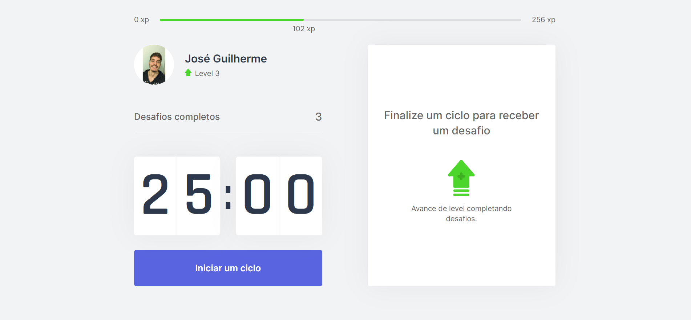

<h1 align="center">
  Move.it
</h1>

  

 

  
  
  
  
  

 

  <a href="README.md">Português</a>
  ·
  <a href="README-en.md">English</a>

<h4 align="center">
    Control your time, be more productive and take care of your health!
<h4>

    <a href="#-notes">Notes</a>&nbsp;&nbsp;&nbsp;|&nbsp;&nbsp;&nbsp;
    <a href="#-layout">Layout</a>&nbsp;&nbsp;&nbsp;|&nbsp;&nbsp;&nbsp;
    <a href="#-version-2.0">Version 2.0</a>&nbsp;&nbsp;&nbsp;|&nbsp;&nbsp;&nbsp;
    <a href="#-technology">Technology</a>&nbsp;&nbsp;&nbsp;|&nbsp;&nbsp;&nbsp;
    <a href="#-getting-started">Getting started</a>&nbsp;&nbsp;&nbsp;|&nbsp;&nbsp;&nbsp;
    <a href="#-how-to-contribute">How to contribute</a>&nbsp;&nbsp;&nbsp;|&nbsp;&nbsp;&nbsp;
    <a href="#-licence">License</a>

## 📑 Notes

- [Notion](https://www.notion.so/zehguilherme/Next-Level-Week-4-e4ceaa95921842c8887635b282e7d2c3)
- [Whimsical](https://whimsical.com/next-level-week-4-UvUTvGe7f7pEkFXyA1Mzcq)

## 🖌️ Layout

- [Figma](https://www.figma.com/file/VGBJqnZ4ur85XDAWVbRrz4/Move.it-1.0-(Copy)?node-id=160%3A2761)

## 🔜 Version 2.0

- [Figma](https://www.figma.com/file/vRbW1u0CEZuG2zE6bU5qLg/Move.it-2.0/duplicate)

## 🚀 Technology

- [ReactJS](https://pt-br.reactjs.org/)
- [Next.js](https://nextjs.org/)
- [TypeScript](https://www.typescriptlang.org/)
- [CSS Modules](https://github.com/css-modules/css-modules)
- [Context API](https://pt-br.reactjs.org/docs/context.html) - Ways to share information between various components of an application
- [Notifications](https://developer.mozilla.org/pt-BR/docs/Web/API/Notification)
  - [Audio manipulation](https://developer.mozilla.org/en-US/docs/Web/API/HTMLAudioElement/Audio)
- [Cookies](https://developer.mozilla.org/pt-BR/docs/Web/HTTP/Cookies) - Store information
  - [js-cookie](https://www.npmjs.com/package/js-cookie) - Facilitates the storage / retrieval of cookie data

## ⌛ Getting started

First, you need to have *node* and *yarn* (or *npm*) installed on your machine.

*If you decide to use npm, don't forget to delete yarn.lock in the folders*

Then you can clone the repository.

`git clone https://github.com/zehguilherme/next-level-week-4`

Launch the application.

1. `cd moveit-next`
2. `yarn or npm install`
3. `yarn dev or npm run dev`

## 🤔 How to contribute

1. Fork this repository;
2. Create a branch with your feature: `git checkout -b my-feature`;
3. Commit your changes: `git commit -m "feat: My new feature"`;
4. Push to your branch: `git push origin my-feature`;
5. Create a pull request;
6. After the merge of your pull request is done, you can delete your branch.

## 📝 Licence

This project is under the MIT license. See the [license](LICENSE) for more information.

---

Made with 💟 by José Guilherme Paro Monteiro Tomaine 👋 [Talk to me!](https://www.linkedin.com/in/jos%C3%A9-guilherme-paro-monteiro-tomaine/)
